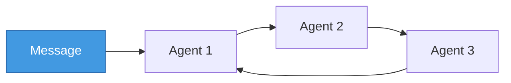
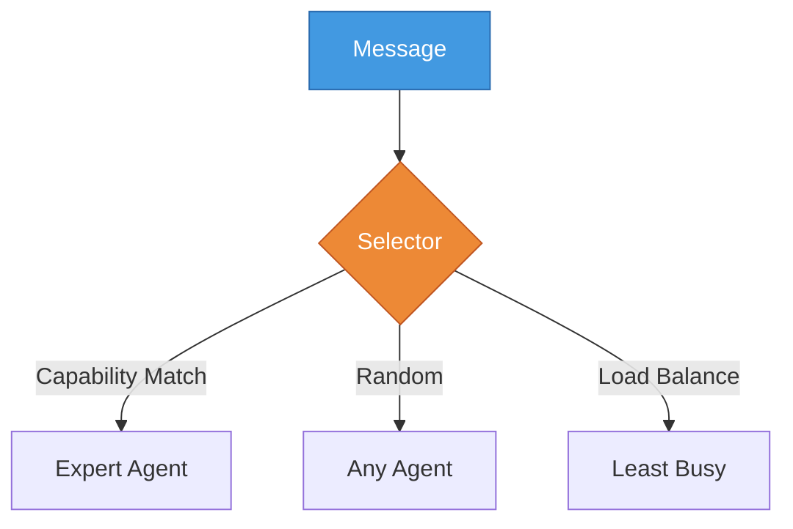
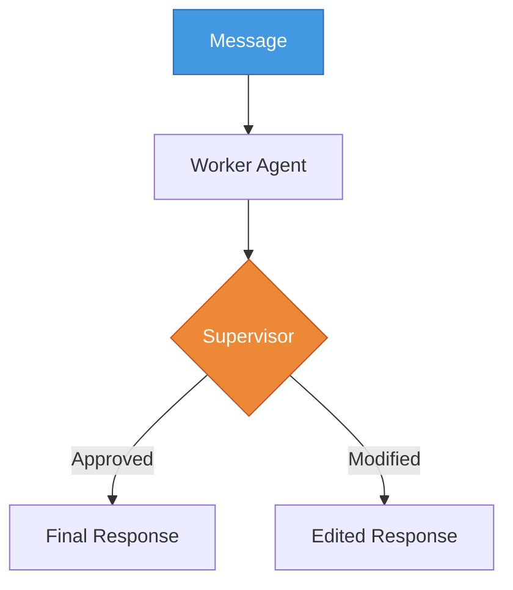
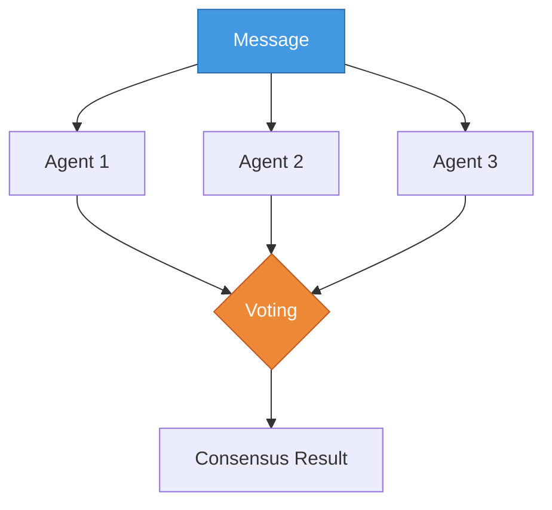
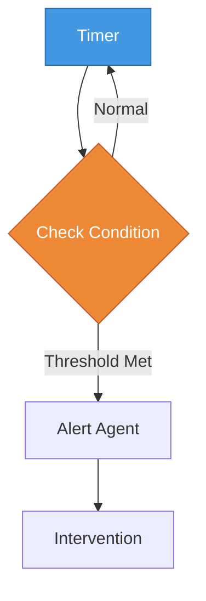
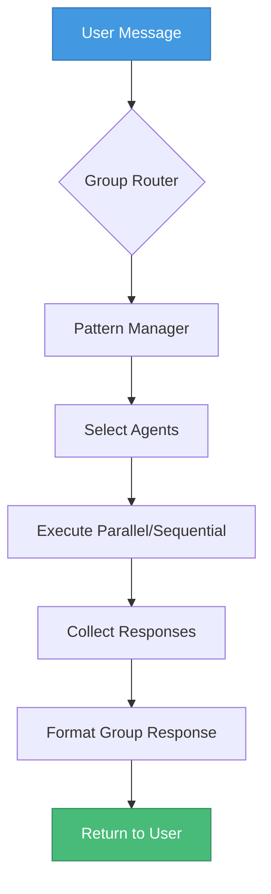

# Pattern Group Coordination

Pattern's group coordination system allows multiple agents to work together, routing messages through various coordination patterns. This enables complex multi-agent behaviors like round-robin discussions, dynamic expertise selection, and pipeline processing.

## Core Components

### 1. Agent Groups

```rust
pub struct AgentGroup {
    pub id: GroupId,
    pub name: String,
    pub description: String,
    pub coordination_pattern: CoordinationPattern,
    pub state: GroupState,
    pub members: Vec<GroupMember>,
    // ...
}
```

Groups are collections of agents that work together using a specific coordination pattern.

### 2. Coordination Patterns

```rust
#[derive(Debug, Clone, Serialize, Deserialize)]
pub enum CoordinationPattern {
    RoundRobin { current_index: usize, skip_unavailable: bool },
    Dynamic { selector: String, config: HashMap<String, String> },
    Pipeline { stages: Vec<PipelineStage> },
    Supervisor { supervisor_agent_id: AgentId },
    Voting { min_votes: usize, require_majority: bool },
    Sleeptime { check_interval_ms: u64, intervention_threshold: f32 },
}
```

Each pattern implements a different strategy for routing messages between agents.

### 3. Group Managers

```rust
#[async_trait]
pub trait GroupManager: Send + Sync {
    async fn route_message(
        &self,
        group: &AgentGroup,
        agents: &[AgentWithMembership<Arc<dyn Agent>>],
        message: Message,
    ) -> Result<GroupResponse>;
}
```

Managers implement the logic for each coordination pattern.

## Coordination Patterns Explained

### Round Robin
Cycles through agents in order, optionally skipping inactive ones.



**Use Cases:**
- Fair distribution of work
- Team discussions where everyone gets a turn
- Load balancing simple tasks

### Dynamic Selection
Uses selectors to choose agents based on various criteria.



**Available Selectors:**
- **Capability**: Matches agent capabilities to message needs
- **Random**: Random selection for variety
- **LoadBalancing**: Chooses least recently used agent

### Pipeline
Processes messages through a sequence of stages.


**Use Cases:**
- Multi-step analysis (understand → plan → execute)
- Document processing pipelines
- Complex workflows with dependencies

### Supervisor
One agent reviews and can modify other agents' responses.



**Use Cases:**
- Quality control
- Safety filtering
- Response refinement

### Voting
Multiple agents vote on responses or decisions.



**Use Cases:**
- Critical decisions
- Consensus building
- Reducing single-agent bias

### Sleeptime
Background monitoring with intervention triggers.



**Use Cases:**
- Deadline monitoring
- Attention management
- Periodic check-ins

## Creating and Using Groups

### Step 1: Create a Group via CLI

```bash
# Create a group with round-robin pattern
pattern-cli group create TaskForce \
  --description "Multi-agent task force" \
  --pattern round-robin

# Create with dynamic selection
pattern-cli group create Experts \
  --description "Expert selection group" \
  --pattern dynamic \
  --selector capability
```

### Step 2: Add Agents to the Group

```bash
# Add agents with specific roles
pattern-cli group add-member TaskForce analyzer \
  --role "Analysis Expert"

pattern-cli group add-member TaskForce planner \
  --role "Strategic Planner"

pattern-cli group add-member TaskForce executor \
  --role "Task Executor"
```

### Step 3: Chat with the Group

```bash
# Start group chat
pattern-cli chat --group TaskForce

# The coordination pattern will route your messages
# according to the group's configuration
```

## Configuration Examples

### In Configuration File

```toml
[[groups]]
name = "BrainTrust"
description = "Executive function support team"
pattern = { type = "round_robin", skip_unavailable = true }

[[groups.members]]
name = "Prioritizer"
agent_id = "agent_12345678-..."  # Optional, will search by name if not provided
role = "Priority Management"
capabilities = ["prioritization", "urgency_assessment"]

[[groups.members]]
name = "TimeKeeper"
role = "Schedule Management"
capabilities = ["scheduling", "time_tracking"]
```

### Programmatic Creation

```rust
// Create group in database
let group_id = create_group_for_user(
    &db,
    user.id.clone(),
    "BrainTrust",
    "Executive function support",
    CoordinationPattern::Dynamic {
        selector: "capability".to_string(),
        config: HashMap::new(),
    },
).await?;

// Add members
add_agent_to_group(
    &db,
    group_id.clone(),
    agent_id,
    GroupMemberRole::Specialist,
    json!({ "focus": "prioritization" }),
).await?;
```

## How Message Routing Works



### Detailed Flow:

1. **Message Received**: User sends message to group
2. **Pattern Routing**: GroupCoordinator identifies the pattern
3. **Manager Selection**: Appropriate GroupManager is instantiated
4. **Agent Selection**: Manager determines which agents to invoke
5. **Execution**: Agents process message (parallel or sequential)
6. **Response Collection**: All agent responses are gathered
7. **State Update**: Group state is updated if needed
8. **Combined Response**: Formatted response returned to user

## Advanced Features

### Dynamic Selector Configuration

```rust
// Capability-based selection with tag matching
let mut config = HashMap::new();
config.insert("match_mode".to_string(), "any".to_string()); // or "all"
config.insert("min_score".to_string(), "0.7".to_string());

// Load balancing with time windows
config.insert("window_minutes".to_string(), "30".to_string());
config.insert("count".to_string(), "2".to_string()); // Select top 2
```

### Pipeline Stage Configuration

```rust
PipelineStage {
    name: "analysis".to_string(),
    agent_selector: AgentSelector::ByCapability {
        required: vec!["analysis".to_string()],
        preferred: vec!["deep_analysis".to_string()],
    },
    timeout_ms: Some(30000),
    optional: false,
}
```

### Group State Management

Groups maintain state between interactions:

```rust
pub enum GroupState {
    RoundRobin { current_index: usize, last_rotation: DateTime<Utc> },
    Pipeline { completed_stages: Vec<String>, stage_results: Map<String, Value> },
    Voting { current_votes: Map<AgentId, Vote>, voting_deadline: DateTime<Utc> },
    // ...
}
```

## Troubleshooting

### Common Issues

1. **"No agents available"**
   - Check agents are active: `pattern-cli group status <name>`
   - Verify membership: Agents must be added to group
   - For capability selector: Ensure agents have required capabilities

2. **Round-robin skipping agents**
   - Check `skip_unavailable` setting
   - Verify agent state is not `Inactive`
   - Look for filtered agents in logs

3. **Pipeline stage failures**
   - Check timeout settings
   - Verify all stages have available agents
   - Review stage dependencies

4. **Dynamic selection not working as expected**
   - Debug with `RUST_LOG=pattern_core::coordination=debug`
   - Check selector configuration parameters
   - Verify agent capabilities match requirements

## Best Practices

### 1. Choose the Right Pattern

- **Round-Robin**: Equal participation, fairness
- **Dynamic**: Expertise matching, load distribution
- **Pipeline**: Sequential processing, workflows
- **Supervisor**: Quality control, safety
- **Voting**: Critical decisions, consensus
- **Sleeptime**: Background monitoring, alerts

### 2. Agent Capabilities

Define clear, specific capabilities:
```toml
# Good
capabilities = ["python_code_review", "security_analysis", "test_generation"]

# Too vague
capabilities = ["coding", "analysis"]
```

### 3. Group Composition

- Keep groups focused on specific purposes
- Mix complementary capabilities
- Consider group size (3-7 agents typically optimal)
- Use roles to clarify each agent's purpose

### 4. State Management

- Groups persist state between conversations
- Reset state if behavior becomes unexpected
- Monitor state in long-running groups

## Integration with Memory System

Groups can share memory between agents:

```rust
// Agents in a group can share memory blocks
agent1.share_memory_with(
    "project_context",
    agent2.id(),
    MemoryPermission::Read,
).await?;
```

This enables:
- Shared context across pipeline stages
- Persistent group knowledge
- Collaborative memory building

## Future Enhancements

Planned improvements include:
- Weighted voting based on expertise
- Dynamic pattern switching based on context
- Group templates for common ADHD support patterns
- Inter-group communication protocols
- Group performance analytics
